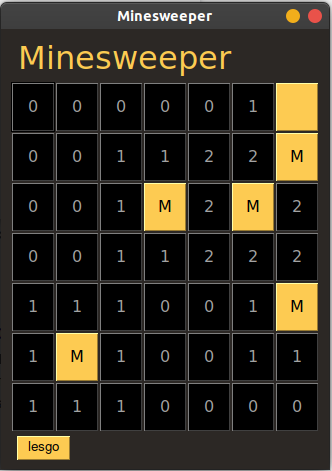

# Minesweeper Agent Based on Knowledge Based System

<p align="center">
    
</p>

## Deskripsi Permainan

Minesweeper merupakan salah satu permainan berbasis board single player yang bertujuan untuk membuka semua tiles pada papan tanpa membuka tile yang berisi bomb. Apabila player berhasil membuak seluruh tiles, maka player tersebut dinyatakan menang. Kalau player membuka tile yang berisi bomb, maka player dinyatakan kalah. Pada aplikasi minesweeper ini, player ini akan digantikan oleh sebuah bot atau agen berbasis KBS yang mampu menyelesaikan program minesweeper ini berdasarkan pengetahuan dan fakta-fakta yang ditanamkan pada agen tersebut.

## User Manual
### Installation Manual
Berikut ini adalah instalasi yang perlu dilakukan agar Minesweeper dapat dijalankan.
1. Lakukan instalasi virtual environment untuk python dengan pip install virtualenv pada windows atau sudo pip install virtualenv pada linux.
2. indah ke dalam folder project dan masukkan perintah python -m venv venv untuk membuat virtual environment pada project.
3. Aktivasi virtual environment dengan path\to\venv\Scripts\activate pada windows atau  source ./venv/bin/activate pada linux dan pengguna akan masuk ke dalam virtual environment.
4. Pada virtual environment lakukan instalasi dari setiap modul yang diperlukan pada program Minesweeper dengan mengetikkan command pip install -r requirements.txt pada root directory.
5. Seluruh modul yang diperlukan sudah terinstall dengan baik.

### How to Use Program
Berikut ini adalah cara penggunaan dari program Minesweeper yang kami bangun.
1. Masukkan data uji dalam bentuk file .txt yang dibuat dengan format sebagai berikut.

**Format Input File**
```
<ukuran board>
<N bomb>
<N koordinat bomb>
```
**Contoh Input File**
```
10
8
0, 6
2, 2
2, 4
3, 3
4, 2
5, 6
6, 2
7, 8
```

2. Jalankan program Minesweeper dengan mengetikkan command ```python gui.py < test\[namafile].txt``` pada root directory windows atau ```python gui.py < ./test/[namafile].txt``` pada root directory linux.
3. Tekan tombol **lesgo** untuk memulai proses inferensi pertama kali dari agen CLIPS.
4. Agen CLIPS akan mengembalikan deretan fakta berupa fakta bomb dan fakta safe sehingga user cukup menekan tombol “Let’s go” untuk melihat setiap langkah yang diambil oleh agen.
5. Permainan Minesweeper akan berakhir apabila seluruh tile sudah dibuka tanpa membuka tile bomb atau agen membuka tile yang berisi bomb.

## Authors
**Minesweeper Experts (K2 Old Gang)**
- 13518035 - Matthew Kevin Amadeus
- 13518041 - Samuel
- 13518056 - Michael Hans
- 13518128 - Lionnarta Savirandy

## Acknowledgments
- Dosen IF3170 K1, Nur Ulfa Maulidevi
- Dosen IF3170 K2, Masayu Leylia Khodra
- Dosen IF3170 K3, Ayu Purwarianti
- Asisten Grafika dan Inteligensi Buatan 2020-2021
- IF3170 Inteligensi Buatan Tahun Ajaran 2020-2021